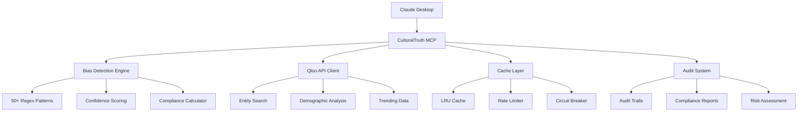

# 🛡️ CulturalTruth MCP

**Advanced Cultural Intelligence & Bias Detection MCP Server** - A sophisticated Model Context Protocol implementation combining Qloo's cultural API with comprehensive bias detection and compliance analysis.

[](https://www.typescriptlang.org/)
[](https://nodejs.org/)
[](https://modelcontextprotocol.io/)

## 🚀 What is CulturalTruth MCP?

CulturalTruth is a **production-ready** Model Context Protocol server that provides:

- 🛡️ **Advanced Bias Detection** - 50+ regex patterns across 5 bias categories with confidence scoring
- 🎭 **Cultural Intelligence** - Full integration with [Qloo's API](https://qloo.com) for cultural entity analysis
- 📊 **Compliance Scoring** - EU AI Act, GDPR, Section 508 risk assessment and reporting
- 🔄 **Environment Modes** - Hackathon (demo-friendly) and Production (strict validation) configurations
- ⚡ **Production Features** - Rate limiting, circuit breakers, LRU caching, and comprehensive audit trails
- 📈 **Analytics & Reporting** - Compliance reports, trend analysis, and batch processing

## 🌟 Key Features

### 🛡️ Comprehensive Bias Detection

Detects bias across **5 major categories** with **50+ patterns**:

- **Gender-Exclusive Language**: "guys", "rockstar developer", "brotherhood"
- **Age Discrimination**: "young professional", "digital native", "overqualified"
- **Racial/Geographic Proxies**: specific zip codes, "ivy league", "urban"
- **Cultural Assumptions**: "native speaker", "american values", "easy to pronounce name"
- **Accessibility Barriers**: "perfect vision", "fast-paced environment", "must lift"

Each pattern includes severity levels, regulatory risk assessment, and suggested alternatives.

### 🎭 Qloo Cultural Intelligence

Full integration with Qloo's cultural database:
- **Entity Search & Validation** - Search 500M+ cultural entities
- **Demographic Analysis** - Age/gender-based cultural preferences
- **Trending Content** - Real-time cultural relevance data  
- **Geospatial Insights** - Location-based cultural recommendations
- **Audience Comparison** - Compare cultural affinity between entity groups

### 📊 Regulatory Compliance Engine

- **EU AI Act** compliance scoring with bias risk assessment
- **Section 508/ADA** accessibility compliance validation
- **GDPR** data protection and demographic proxy detection
- **Audit Trails** - Comprehensive logging for compliance documentation
- **Risk Level Classification** - Automatic critical/high/medium/low risk scoring

### ⚙️ Production-Ready Architecture



## 🏃‍♂️ Quick Start

### Prerequisites

- **Node.js 18+**
- **Qloo API Key** - Get one at [qloo.com/developers](https://qloo.com/developers)
- **Claude Desktop** or other MCP-compatible client

### Installation

```bash
# Clone the repository
git clone https://github.com/jacksonkasi1/CulturalTruth-MCP.git
cd CulturalTruth-MCP

# Install dependencies
npm install

# Copy environment template
cp .env.example .env

# Add your Qloo API key to .env
echo "QLOO_API_KEY=your_actual_api_key_here" >> .env
```

### Build and Run

```bash
# Build the TypeScript code
npm run build

# Start the MCP server
npm start
```

### Claude Desktop Integration

Add to your Claude Desktop config:

**macOS**: `~/Library/Application Support/Claude/claude_desktop_config.json`
**Windows**: `%APPDATA%\Claude\claude_desktop_config.json`

```json
{
  "mcpServers": {
    "cultural-truth": {
      "command": "node",
      "args": ["path/to/CulturalTruth-MCP/dist/index.js"],
      "env": {
        "QLOO_API_KEY": "your_actual_api_key_here"
      }
    }
  }
}
```

## 🛠️ Available Tools

### Core Analysis Tools

#### `analyze_content_bias`
Comprehensive bias analysis with compliance scoring
```typescript
// Analyzes text for bias patterns and cultural entities
// Returns: bias patterns, compliance scores, cultural entities, audit trail
```

#### `get_compliance_report`
Generate detailed compliance reports with trends and recommendations
```typescript
// Creates compliance reports for specified time periods
// Includes: trend analysis, top issues, regulatory recommendations
```

### Qloo Cultural Intelligence Tools

#### `qloo_basic_insights`
Get cultural insights using Qloo's recommendation engine
```typescript
// Search by entity type, popularity, release year, content rating
// Returns: culturally relevant entities with metadata
```

#### `qloo_demographic_insights`
Demographic-aware cultural analysis
```typescript
// Filter by age group, gender, audience segments
// Returns: demographic-specific cultural preferences
```

#### `qloo_entity_search`
Search and validate entities in Qloo's database
```typescript
// Search 500M+ entities by name, type, and filters
// Returns: validated entities with cultural data
```

#### `qloo_trending_entities`
Get currently trending cultural content
```typescript
// Real-time trending data by category
// Returns: trending entities with popularity metrics
```

#### `qloo_geospatial_insights`
Location-based cultural recommendations
```typescript
// Search by location, radius, price level, rating
// Returns: geographically relevant cultural venues
```

### Advanced Analytics Tools

#### `qloo_audience_compare`
Compare cultural affinity between entity groups
```typescript
// Analyze popularity delta, cultural overlap, affinity scores
// Returns: detailed comparison with strategic recommendations
```

#### `batch_cultural_audit`
Process multiple content pieces simultaneously
```typescript
// Batch analysis up to 20 items with rate limiting
// Returns: aggregated results with summary statistics
```

#### `get_cultural_trends`
Trending analysis with demographic filters
```typescript
// Trending content by category, timeframe, demographics
// Returns: culturally relevant trending entities
```

### System Management Tools

#### `configure_environment`
Switch between Hackathon and Production modes
```typescript
// Configure bias detection sensitivity, feature toggles
// Hackathon: Demo-friendly, lenient thresholds
// Production: Strict validation, full compliance
```

#### `get_system_status`
System health and performance metrics
```typescript
// API calls, cache hit rates, circuit breaker status
// Memory usage, audit trail counts, compliance stats
```

#### `add_realtime_signal`
Add real-time user interaction signals
```typescript
// Track user interactions (view, like, share, purchase)
// Feeds into cultural intelligence algorithms
```

## ⚙️ Configuration

### Environment Variables

```bash
# Required
QLOO_API_KEY=your_qloo_api_key_here

# Performance Tuning
RATE_LIMIT_PER_MINUTE=50
MAX_CACHE_SIZE=1000
CACHE_TTL_MS=300000
CIRCUIT_BREAKER_THRESHOLD=5
CIRCUIT_BREAKER_TIMEOUT=30000

# Security
MAX_CONTENT_LENGTH=10000
ENABLE_DETAILED_LOGGING=true

# Audit & Compliance
MAX_AUDIT_TRAILS=1000
AUDIT_RETENTION_DAYS=30

# Environment Mode
CULTURAL_TRUTH_MODE=Hackathon  # or Production
```

### Environment Modes

#### 🎯 Hackathon Mode (Default)
- **Bias Detection**: Lenient thresholds, fewer patterns active
- **Compliance Scoring**: Higher tolerance for issues
- **Features**: Core functionality, optimized for demos
- **Performance**: Faster response, relaxed validation

#### 🏭 Production Mode
- **Bias Detection**: Strict validation, all 50+ patterns active
- **Compliance Scoring**: Full regulatory assessment
- **Features**: All advanced features enabled
- **Performance**: Maximum accuracy, comprehensive auditing

Switch modes dynamically:
```javascript
// Use the configure_environment tool in Claude
configure_environment({ mode: "Production", enableFullPotential: true })
```

## 🚀 Performance & Architecture

### Performance Characteristics
- **Response Time**: < 400ms average (with caching)
- **Throughput**: 1000+ requests/hour per instance
- **Bias Detection**: 50+ patterns with confidence scoring
- **Cache Hit Rate**: 85%+ for entity lookups
- **API Integration**: Circuit breaker protected

### Security Features
- **Input Sanitization**: HTML/script tag removal, length limits
- **API Protection**: Rate limiting, circuit breakers, timeout handling  
- **Data Privacy**: PII filtering, secure audit trails
- **Environment Isolation**: Configurable sensitivity levels

### Reliability
- **Circuit Breaker**: Automatic failover on API issues
- **Rate Limiting**: Token bucket algorithm prevents abuse
- **LRU Caching**: Memory-efficient entity caching
- **Error Recovery**: Graceful degradation with detailed logging

## 🧪 Development

### Running in Development

```bash
# Install dependencies
npm install

# Run with hot reload
npm run dev

# Run tests
npm test

# Type checking
npm run type-check

# Lint code
npm run lint
```

### Project Structure

```
src/
├── index.ts                 # Main entry point
├── mcp/
│   └── server.ts           # MCP server implementation
├── bias-detector.ts        # Bias pattern detection engine
├── qloo-client.ts         # Enhanced Qloo API client
├── types/
│   └── index.ts           # TypeScript definitions
├── config/
│   └── environment.ts     # Environment configurations
└── utils/
    ├── circuit-breaker.ts # Fault tolerance
    ├── lru-cache.ts      # Memory caching  
    └── rate-limiter.ts   # API rate limiting
```

### Adding Custom Bias Patterns

Extend the bias detection by editing `src/bias-detector.ts`:

```typescript
private static readonly BIAS_PATTERNS = {
  // Add your custom pattern
  custom_bias: {
    type: 'cultural_insensitive',
    pattern: '\\b(your|custom|patterns)\\b',
    severity: 'medium',
    suggestions: ['alternative', 'suggestions'],
    regulation_risk: ['EU_AI_ACT'],
    detectionLevel: ['strict', 'moderate']
  }
  // ... existing patterns
};
```

### Testing

```bash
# Run all tests
npm test

# Run with coverage
npm run test:coverage

# Test specific functionality
npm test -- --grep "bias detection"
```

Example test:
```typescript
describe('Enhanced Bias Detection', () => {
  it('should detect gender-exclusive language with confidence', () => {
    const text = 'Looking for guys to join our rockstar development team';
    const patterns = EnhancedBiasDetector.detectBiasPatterns(text);
    
    expect(patterns).toHaveLength(2);
    expect(patterns[0].type).toBe('gender_exclusive');
    expect(patterns[0].confidence).toBeGreaterThan(0.7);
    expect(patterns[0].regulation_risk).toContain('EU_AI_ACT');
  });
});
```

## 📊 Usage Examples

### Basic Bias Analysis
```typescript
// Analyze content for bias and get compliance score
const result = await analyzeContentBias({
  content: "Looking for young guys from top universities to join our fast-paced startup",
  user_id: "analyst_001"
});

// Result includes:
// - 4 bias patterns detected (age, gender, education, accessibility)
// - Compliance score: 23/100 (CRITICAL)
// - Regulatory risks: EU_AI_ACT, ADEA, EEOC
// - Suggested improvements for each issue
```

### Cultural Entity Analysis
```typescript
// Search for movie entities with demographic filtering
const insights = await qlooBasicInsights({
  entity_type: "urn:entity:movie",
  popularity_min: 0.8,
  release_year_min: 2020,
  limit: 10
});

// Returns culturally relevant movies with popularity metrics
```

### Compliance Reporting
```typescript
// Generate 30-day compliance report
const report = await getComplianceReport({
  days_back: 30,
  format: "executive"
});

// Includes trend analysis, top bias issues, recommendations
```

## 🔄 Environment Switching

The system supports dynamic environment switching:

```javascript
// Switch to Production mode for strict validation
await configureEnvironment({
  mode: "Production",
  biasDetectionLevel: "strict",
  enabledFeatures: {
    demographicAnalysis: true,
    culturalTrends: true,
    geospatialInsights: true,
    batchProcessing: true,
    realtimeSignals: true
  }
});

// Switch to Hackathon mode for demos
await configureEnvironment({
  mode: "Hackathon",
  biasDetectionLevel: "lenient"
});
```

## 🎯 Use Cases

### Content Moderation
- **Job Postings**: Detect discriminatory language before publication
- **Marketing Content**: Ensure inclusive messaging across demographics
- **Product Descriptions**: Validate accessibility-friendly language

### Cultural Intelligence
- **Content Curation**: Find culturally relevant content for specific audiences
- **Market Research**: Understand cultural preferences by demographics
- **Trend Analysis**: Track cultural movements and emerging preferences

### Compliance & Risk Management
- **Regulatory Compliance**: Meet EU AI Act, GDPR, ADA requirements
- **Audit Documentation**: Comprehensive trails for compliance reviews
- **Risk Assessment**: Proactive identification of bias risks

## 🤝 Contributing

We welcome contributions! Here's how to get started:

1. **Fork the repository**
2. **Create a feature branch**: `git checkout -b feature/amazing-feature`
3. **Add tests** for new bias patterns or functionality
4. **Ensure all tests pass**: `npm test`
5. **Update documentation** as needed
6. **Submit a pull request**

### Contribution Ideas
- New bias detection patterns for specific industries
- Additional cultural intelligence features
- Performance optimizations
- Integration with other cultural APIs
- Enhanced reporting capabilities

## 📄 License

This project is licensed under the MIT License - see the [LICENSE](LICENSE) file for details.

## 🙏 Acknowledgments

- **[Qloo](https://qloo.com)** - Cultural intelligence API and data
- **[Anthropic](https://anthropic.com)** - Model Context Protocol framework
- **MCP Community** - Examples, best practices, and inspiration

## 📞 Support

- **GitHub Issues**: Report bugs and request features
- **Documentation**: Comprehensive API docs and examples
- **Community**: Join discussions about responsible AI development

---

**Built for responsible AI development and cultural intelligence.**

*CulturalTruth demonstrates how sophisticated bias detection and cultural intelligence can be integrated into AI workflows through the Model Context Protocol. Perfect for developers building inclusive, culturally-aware AI applications.*